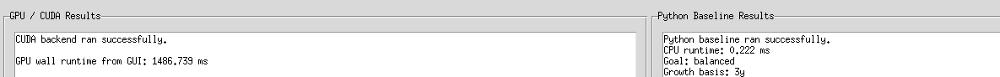

#### Dylan Renard  
#### EN.605.617 Introduction to GPU Programming (JHU)  
#### Professor Chance Pascale  
#### March 22nd, 2026  

# CUDA Dividend Portfolio Allocation Optimizer  
## GPU-Accelerated Portfolio Construction Using cuBLAS / cuSOLVER

---

# Overview

This project presents a **CUDA-accelerated financial modeling application** designed to assist users in constructing optimized dividend portfolios from large stock universes.

The system integrates:

- A **Tkinter GUI** for interactive exploration  
- A **CUDA backend** using cuBLAS and cuSOLVER  
- A **Python baseline solver** for validation  
- A **data ingestion pipeline** supporting real-world financial datasets  

Unlike earlier experimental CUDA work (e.g., emulator-based projects), this application focuses on a **practical, real-world use case**: portfolio construction under user-defined constraints.

---

# Motivation

Modern investors evaluate:

- Growth (CAGR over multiple time horizons)
- Dividend yield (income generation)
- Portfolio balance (growth vs income tradeoff)

When scaling to **hundreds or thousands of stocks**, the computational cost increases significantly.

This project explores:

> When does GPU acceleration become advantageous for financial modeling?

---

# System Architecture

The system begins with user input through the GUI, where investment preferences, stock selections, and financial parameters are defined. These inputs are then passed to a data ingestion layer that processes either clean CSV files or raw Barchart exports, normalizing them into a consistent format. From there, a feature matrix is constructed, representing each stock in terms of its price, growth metrics, and dividend yield. This matrix is then fed into the CUDA-based solver, which performs the necessary linear algebra computations to determine optimal portfolio allocations. The resulting allocation is returned to the GUI for visualization, while a Python-based CPU baseline is executed in parallel to provide a direct performance and correctness comparison.

---

# Data Processing Pipeline

## Supported Inputs

### Clean CSV Format
ticker,price_now,cagr_3y,cagr_5y,dividend_yield

### Raw Barchart Export

The `barchart.py` module:
- Removes trailing metadata rows ("Downloaded...")
- Normalizes column names
- Fills missing values
- Outputs standardized CSV

---

# Mathematical Model

Each stock i is represented as:

x_i = [price, CAGR_3y, CAGR_5y, dividend_yield]

## Composite Score

S_i = w_g * growth_i + w_d * dividend_i

Where:
- growth_i = function of CAGR values
- dividend_i = dividend yield
- weights depend on user goal (growth, income, balanced)

---

## Allocation System

We solve:

A * w = b

This formulation allows the portfolio allocation problem to be expressed as a system of linear equations, enabling efficient parallel solution using GPU-accelerated linear algebra routines.

Where:
- A encodes relationships between stocks
- w is the allocation vector
- b is normalized investment target

---

# CUDA Implementation

The GPU backend performs:

- Matrix construction
- Linear algebra operations
- System solving

Libraries used:
- cuBLAS → matrix operations
- cuSOLVER → linear system solve

cuBLAS is used to efficiently construct and manipulate the feature matrix A through optimized GPU matrix operations, while cuSOLVER consumes this matrix to solve the resulting linear system A * w = b. This demonstrates a tightly coupled pipeline where one library directly feeds into the other.

---

# Performance Results

## Small Input (5 Stocks)

GPU runtime: ~1486 ms  
CPU runtime: ~0.22 ms  

### Interpretation

GPU is slower due to:
- Kernel launch overhead
- Memory transfer cost

---

## Large Input (1000 Stocks)

GPU runtime: ~656 ms  
CPU runtime: ~16294 ms  

### Interpretation

GPU achieves ~25x speedup due to:
- Parallel matrix operations
- Increased computational workload

---

# Key Insight: Crossover Point

There exists a threshold where:

- Small N → CPU faster  
- Large N → GPU faster  

This reflects a fundamental property of GPU computing:
> Overhead dominates small workloads, parallelism dominates large workloads

---

# Conclusion
This project highlights a key lesson in GPU computing: CUDA is not universally faster, but instead provides conditional performance benefits that emerge only when problem scale justifies parallel execution. Through direct comparison of small and large portfolio sizes, we observed the fundamental tradeoff between overhead and parallelism, where GPU execution is initially hindered by memory transfer and launch costs, but ultimately surpasses CPU performance as computational complexity increases. In doing so, this work bridges the gap between academic GPU exercises and real-world computational applications, demonstrating how theoretical concepts such as parallel linear algebra, workload scaling, and hardware utilization translate into practical decision-support tools. More broadly, it emphasizes that effective GPU programming is not just about writing kernels, but about understanding when and why to use the GPU, designing systems that scale appropriately, and aligning computational strategies with the structure of the underlying problem.
