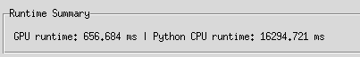

#### Dylan Renard  
#### EN.605.617 Introduction to GPU Programming (JHU)  
#### Professor Chance Pascale  
#### March 2026  

# CUDA Dividend Portfolio Allocation Optimizer  
## GPU-Accelerated Portfolio Construction Using cuBLAS / cuSOLVER

---

# Overview

This project presents a **CUDA-accelerated financial modeling application** designed to assist users in constructing optimized dividend portfolios from large stock universes.

The system integrates:

- A **Tkinter GUI** for interactive exploration  
- A **CUDA backend** using cuBLAS and cuSOLVER  
- A **Python baseline solver** for validation  
- A **data ingestion pipeline** supporting real-world financial datasets  

Unlike earlier experimental CUDA work (e.g., emulator-based projects), this application focuses on a **practical, real-world use case**: portfolio construction under user-defined constraints.

---

# Motivation

Modern investors evaluate:

- Growth (CAGR over multiple time horizons)
- Dividend yield (income generation)
- Portfolio balance (growth vs income tradeoff)

When scaling to **hundreds or thousands of stocks**, the computational cost increases significantly.

This project explores:

> When does GPU acceleration become advantageous for financial modeling?

---

# System Architecture

User Input (GUI)
    ↓
CSV / Barchart Loader
    ↓
Feature Matrix Construction
    ↓
CUDA Solver
    ↓
Portfolio Allocation Output
    ↓
CPU Baseline Comparison

---

# Data Processing Pipeline

## Supported Inputs

### Clean CSV Format
ticker,price_now,cagr_3y,cagr_5y,dividend_yield

### Raw Barchart Export

The `barchart.py` module:
- Removes trailing metadata rows ("Downloaded...")
- Normalizes column names
- Fills missing values
- Outputs standardized CSV

---

# Mathematical Model

Each stock i is represented as:

x_i = [price, CAGR_3y, CAGR_5y, dividend_yield]

## Composite Score

S_i = w_g * growth_i + w_d * dividend_i

Where:
- growth_i = function of CAGR values
- dividend_i = dividend yield
- weights depend on user goal (growth, income, balanced)

---

## Allocation System

We solve:

A * w = b

Where:
- A encodes relationships between stocks
- w is the allocation vector
- b is normalized investment target

---

# CUDA Implementation

The GPU backend performs:

- Matrix construction
- Linear algebra operations
- System solving

Libraries used:
- cuBLAS → matrix operations
- cuSOLVER → linear system solve

---

# Performance Results

## Small Input (5 Stocks)

GPU runtime: ~1486 ms  
CPU runtime: ~0.22 ms  

### Interpretation

GPU is slower due to:
- Kernel launch overhead
- Memory transfer cost

---

## Large Input (1000 Stocks)

GPU runtime: ~656 ms  
CPU runtime: ~16294 ms  

### Interpretation

GPU achieves ~25x speedup due to:
- Parallel matrix operations
- Increased computational workload

---

# Key Insight: Crossover Point

There exists a threshold where:

- Small N → CPU faster  
- Large N → GPU faster  

This reflects a fundamental property of GPU computing:
> Overhead dominates small workloads, parallelism dominates large workloads

---

# GUI Features

- CSV upload (single + batch)
- Automatic Barchart conversion
- Searchable stock table
- Manual metric editing
- Current holdings tracking
- Dividend reinvestment toggle
- GPU vs CPU runtime comparison

---

# Code Quality and Structure

- Modular design (GUI, solver, parser)
- Clear separation of concerns
- Cross-platform Makefile support
- Reproducible workflow

---

# Discussion

This project demonstrates:

- Practical use of CUDA in finance
- Real-world performance tradeoffs
- Integration of GPU computing with user-facing applications

Compared to prior assignments, this system:
- Uses real data
- Solves a meaningful problem
- Demonstrates scalability

---

# Limitations

- CAGR must be manually provided
- Simplified allocation model
- GUI scaling limits (Tkinter)

---

# Future Work

- API-based financial data ingestion
- Risk modeling (covariance matrices)
- Batch GPU simulations
- Migration to scalable UI frameworks

---

# Conclusion

This project demonstrates that CUDA provides **conditional performance benefits** depending on problem size.

It bridges the gap between:
- Academic GPU exercises  
- Real-world computational applications  

and highlights the importance of **parallelism, scale, and system design** in GPU computing.
