# CUDA Threads and Blocks Assignment  
## Matrix Addition with Picture Frame Branching (CUDA Threads & Blocks)

---

## Overview

This repo compares **CPU vs GPU** performance for the **same algorithm** (element-wise matrix addition) and studies how CUDA **execution configuration** (blocks / threads-per-block) and **conditional branching** affect runtime.

Two versions of the computation are implemented on both CPU and GPU:

1. **Baseline (minimal branching)**  
   \( C[i] = A[i] + B[i] \) for all elements

2. **Branched (“picture frame” border exclusion)**  
   If element is in the **interior region**, compute \(A+B\); otherwise (border), copy \(A\).  
   This models common image-processing logic and introduces **warp divergence** on the GPU.

---

## Problem Setup

- Matrix size: **2048 × 2048**
- Total elements: **N = 2048 × 2048 = 4,194,304 (2²²)**
- Fixed border thickness: **32**
- Data type: `float`
- GPU kernels use a **grid-stride loop** so all N elements are processed even when `blocks × threads < N`.

---

## Project Structure (key items)

```text
assignment.cu            # CUDA + CPU implementations + timing + guardrails
Makefile                 # Builds assignment.exe
charts.py                # Reads sweep_results.csv and writes figures
charts_out/              # All generated charts and heatmaps (PNG)
sweep_launch_configs.py  # Python script to run many tests of the assignment code.
sweep_out/               # Stores all exploratory run logs from sweep_launch_configs.py
sweep_results.csv        # Output from parameter sweep script (blocks × threads)  
RunLogs/                 # timing_results_<blocks>_<threads>.txt from individual runs
README.md                # This file
```

> Note: the repo stores plots in **charts_out/**. The image links below assume that location.

---

## Build

```bash
make
```

Produces: `assignment.exe`

---

## Run

```bash
./assignment.exe <num_blocks> <threads_per_block>
```

Required example (spec):

```bash
./assignment.exe 512 256
```

### Output behavior (what prints)
At runtime the program prints:
- GPU device name and device limits (max threads/block, max grid X dimension)
- Final (possibly clamped) launch configuration:
  - Blocks
  - Threads per block
  - Total threads launched
- Timings (nanoseconds):
  - GPU baseline
  - GPU branched
  - CPU baseline
  - CPU branched
- The output filename written (e.g., `timing_results512_256.txt`)

### Guardrails (malformed / extreme CLI inputs)
The program defensively handles bad inputs:
- Missing args → defaults `(512, 256)`
- Non-numeric / zero / negative → clamped to `1`
- `threads_per_block` > device max → clamped to `maxThreadsPerBlock`
- Extremely large launches (e.g., `100000000 256`) → blocks are clamped using a **conservative upper bound** of `~10×N` total threads to avoid overflow and wasted work

---

## Timing Methodology (what the numbers mean)

- CPU timing: `std::chrono::high_resolution_clock` around the full CPU loop
- GPU timing: wall-clock timing around the kernel launch **plus** `cudaDeviceSynchronize()`  
  This ensures the measured interval includes **kernel execution** (CUDA launches are otherwise async).
- A warm-up kernel runs once before timing to avoid first-launch CUDA context/JIT overhead.

> Note: `std::chrono` GPU timing includes small host-side overhead. CUDA events would isolate device time more precisely, but this is sufficient for the assignment’s goals (configuration comparison + branching impact).

---

## Parameter Sweep

A full grid search was run over 8×8 configurations:

- **Blocks:** `1, 4, 16, 64, 256, 1024, 4096, 16384`
- **Threads per block:** `8, 16, 32, 64, 128, 256, 512, 1024`

Each combination produced timings recorded into `sweep_results.csv`.  
`charts.py` generates all plots into `charts_out/`.

To reproduce charts:

```bash
python3 charts.py
```

---

# Results and Analysis (from charts_out charts)

Below are the key takeaways, tied directly to the generated figures.

## 1) GPU runtime depends strongly on launch configuration

### Heatmaps: GPU baseline and GPU branched

- **GPU baseline heatmap:** `charts_out/heat_gpu_baseline.png`  
- **GPU branched heatmap:** `charts_out/heat_gpu_branched.png`

These heatmaps show that **GPU runtime drops dramatically** as launch size increases from tiny configurations.

**Why:** with too few blocks/threads, the GPU is underutilized (many SMs idle).  
Even though the kernel uses a grid-stride loop (so it still completes), a small number of threads must “walk” the array, reducing parallelism.

As blocks and threads increase:
- more warps are resident
- occupancy improves
- memory latency is hidden better
- runtime approaches a **plateau** (diminishing returns once the GPU is saturated)

**How to say this in one sentence:**  
> GPU performance improves quickly until the device is saturated; beyond that point, more blocks/threads provide little benefit.

## 2) “Good” thread block sizes cluster around warp-friendly ranges

### Runtime vs threads (blocks fixed)
- `charts_out/runtime_vs_threads_blocks256.png`

For a fixed block count, increasing threads-per-block typically improves performance from very small values (8–32) up into moderate values (128–256). After that, performance tends to **plateau**.

**Interpretation:**  
- Very small thread blocks do not create enough warps for efficient scheduling.
- Moderate thread blocks (often 128–256) usually balance occupancy and scheduling well.
- Very large thread blocks (512–1024) can reduce flexibility (e.g., resource limits / register pressure) and don’t necessarily speed things up further.

## 3) Branching slows the GPU, but helps the CPU (expected!)

### Heatmaps + runtime plots
- GPU baseline vs branched heatmaps: `heat_gpu_baseline.png`, `heat_gpu_branched.png`
- Runtime vs blocks: `charts_out/runtime_vs_blocks_threads128.png`
- Runtime vs threads: `charts_out/runtime_vs_threads_blocks256.png`

**GPU:** branched kernel is consistently slower than baseline.  
**CPU:** branched loop is often faster than CPU baseline because it skips work on the border.

This “opposite” behavior is one of the main lessons:

- On CPU, a branch that skips work can reduce runtime (and branch predictors can help).
- On GPU, branching can cause **warp divergence**: within a warp, some threads take the “interior” path and others take the “border” path, forcing serialization of paths.

**Write-up wording:**  
> The CPU benefits from skipping border work, while the GPU pays a divergence penalty because warps execute both branch paths when threads disagree.

## 4) Branching penalty varies with configuration (divergence + occupancy interaction)

### Branch penalty plots (ratio branched/baseline)
- `charts_out/gpu_branch_penalty_vs_blocks_threads128.png`
- `charts_out/gpu_branch_penalty_vs_threads_blocks256.png`

The branching penalty is not a single constant value; it changes with launch configuration.

**Why it varies:**
- Divergence occurs primarily near the border region
- How border elements map onto warps depends on indexing and scheduling
- Occupancy affects how much divergence cost can be hidden

**Practical takeaway:**  
> Even for the same algorithm and data, GPU control-flow cost depends on how the work is scheduled (blocks/threads).

## 5) Speedup: GPU is consistently faster, but branching reduces speedup

### Speedup plots
- `charts_out/speedup_vs_blocks_threads128.png`
- `charts_out/speedup_vs_threads_blocks256.png`

These plots show CPU/GPU speedup for baseline and branched kernels.

**Typical pattern:**
- Speedup rises quickly as GPU configuration improves (more parallelism)
- Speedup plateaus once GPU reaches near-saturation
- Branched speedup is lower than baseline speedup due to divergence

This demonstrates the assignment’s target concept clearly:
- **threads/blocks tuning matters**
- **branching matters**
- GPU remains faster for this data-parallel problem, but the gap shrinks under divergence

## 6) CPU runtime is mostly constant; fluctuations are measurement noise

### CPU heatmaps
- `charts_out/heat_cpu_baseline.png`
- `charts_out/heat_cpu_branched.png`

The CPU algorithm does not use CUDA launch parameters, so it should not systematically depend on blocks/threads.

Small fluctuations appear due to:
- OS scheduling / background processes
- CPU turbo/frequency scaling
- cache state and measurement noise

**One-liner explanation:**  
> CPU timings vary slightly across runs because we measure wall-clock time on a multitasking OS, not because the CPU algorithm changes with CUDA parameters.

---

## Figures (embedded)

### Heatmaps
- 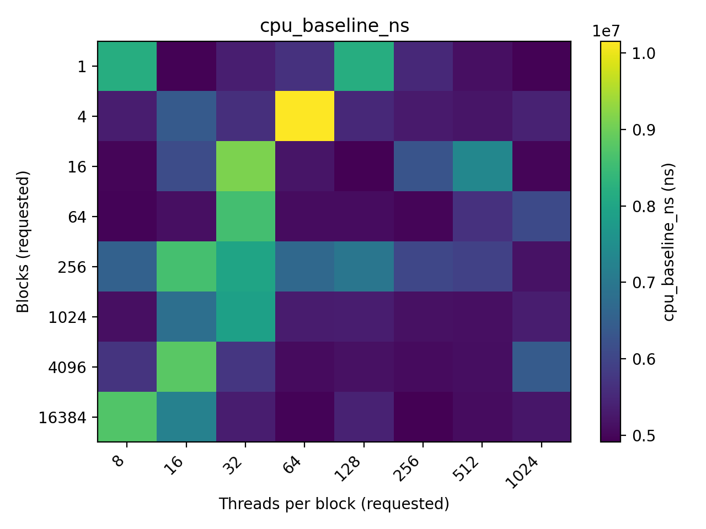
- 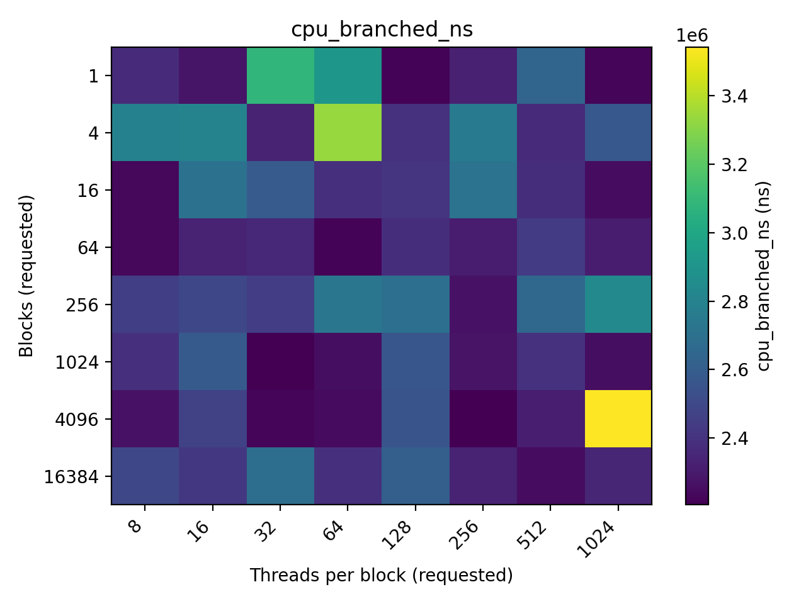
- 
- 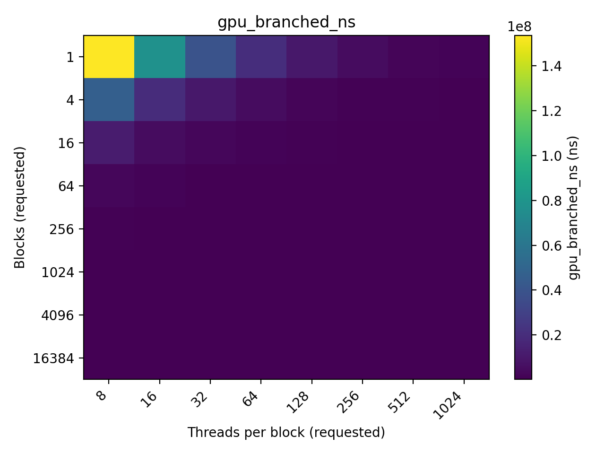

### Runtime trends
- 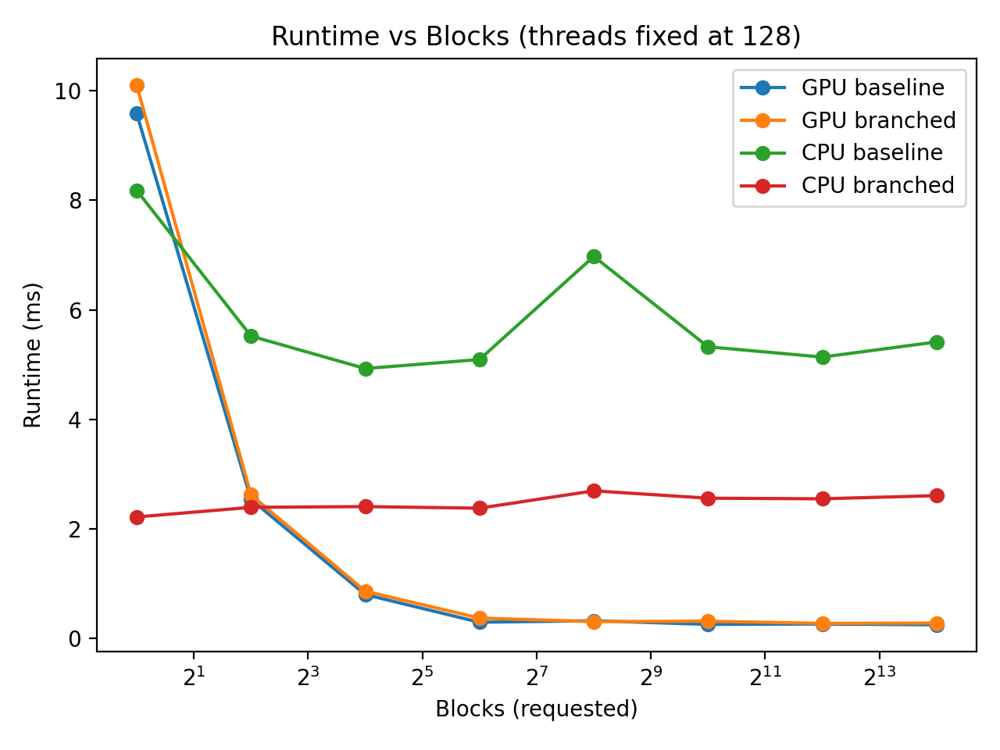
- 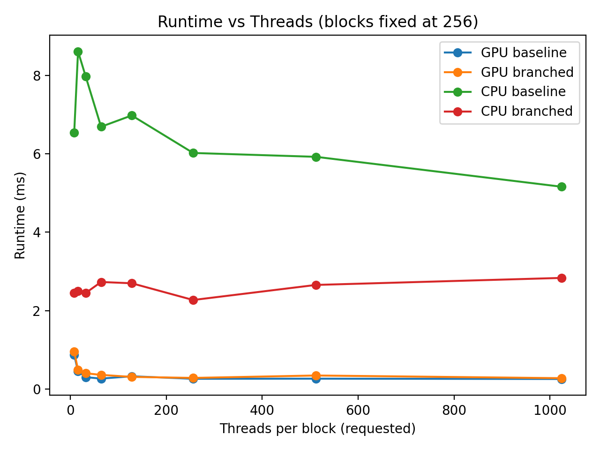

### Divergence / branching penalty
- 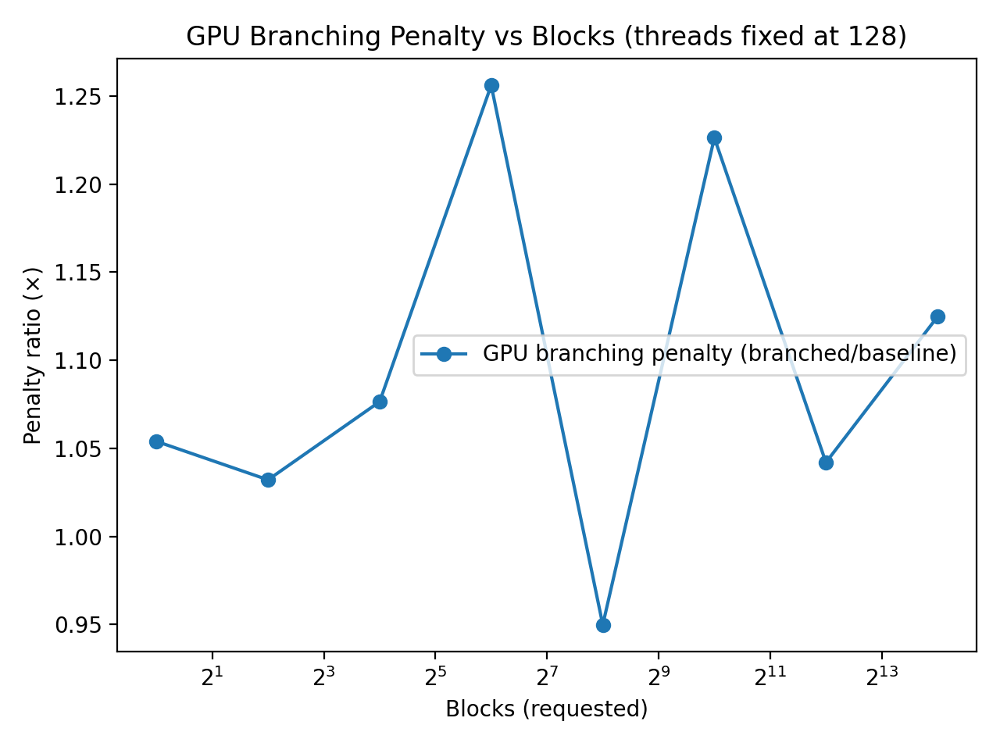
- 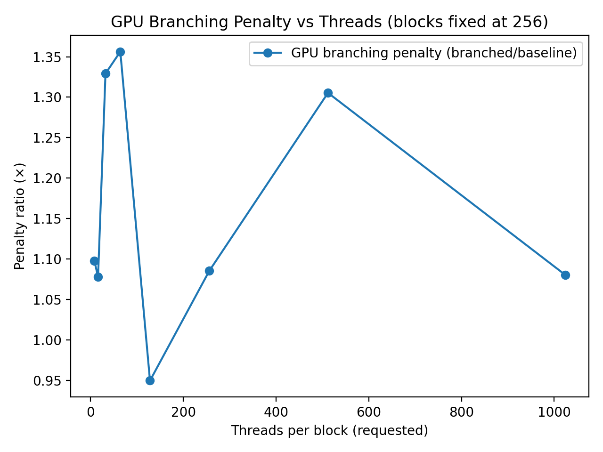

### Speedup and CPU vs GPU scatter
- 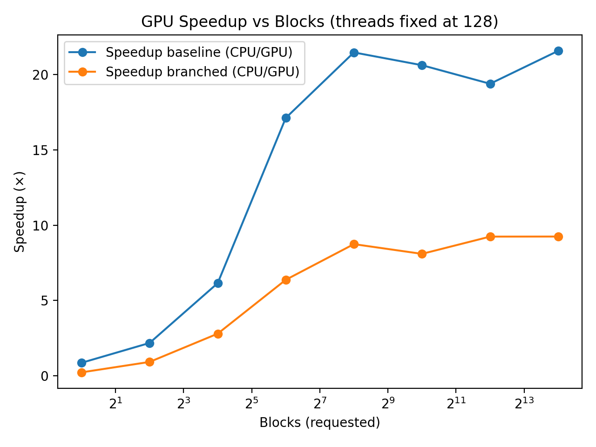
- 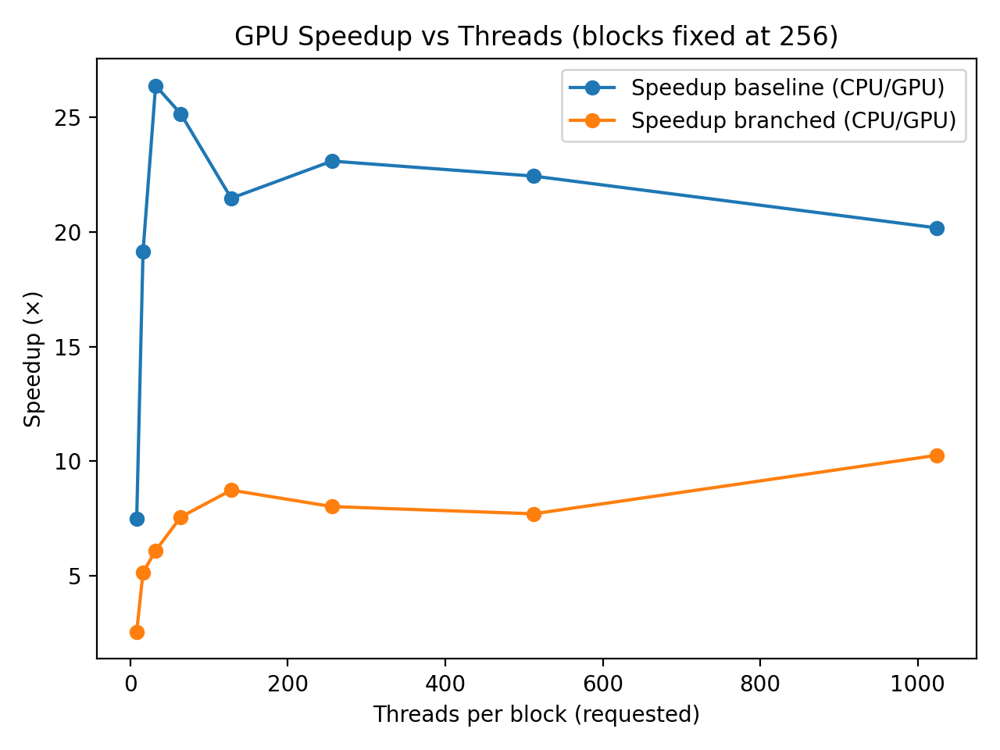
- 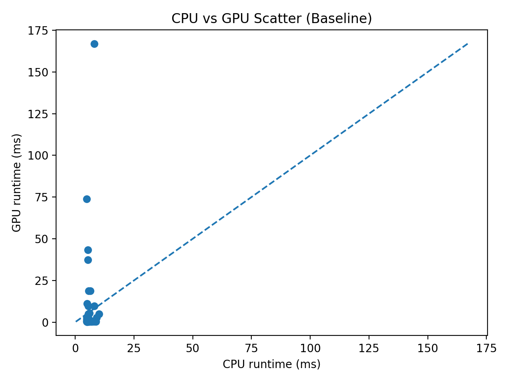
- 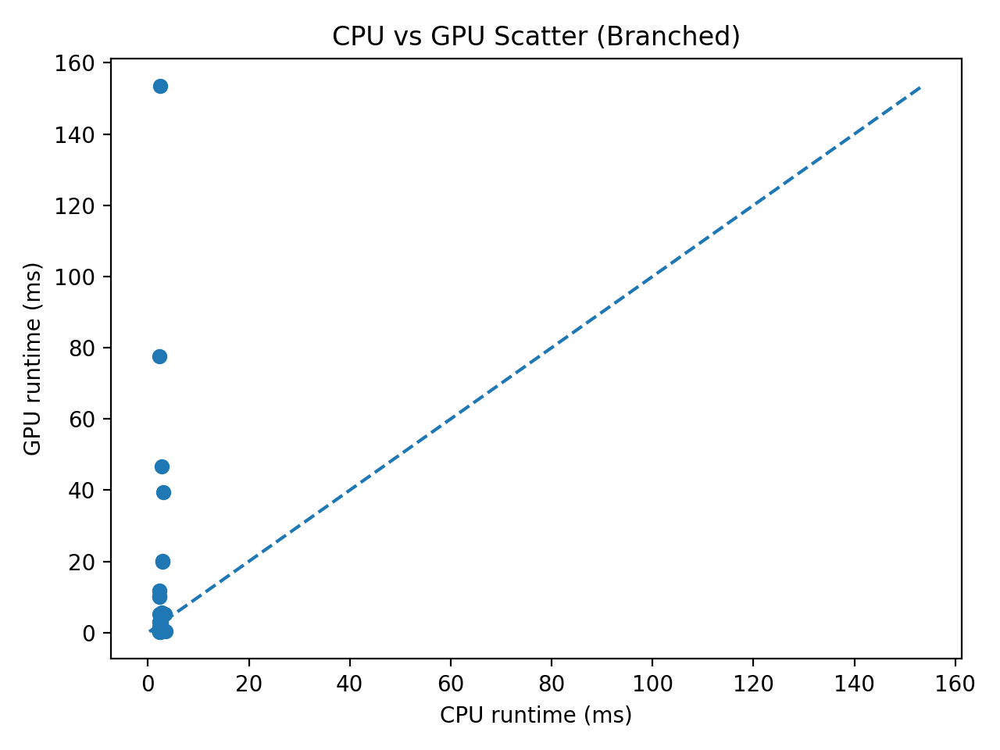

---

## Conclusion (rubric-aligned)

This project satisfies the assignment goals by:

- Implementing the **same algorithm** on CPU and GPU (baseline and branched variants)
- Using user-controlled **blocks and threads-per-block**
- Measuring runtime and demonstrating that GPU performance depends strongly on launch configuration
- Demonstrating that **conditional branching reduces GPU efficiency** (warp divergence) while it can reduce work (and runtime) on the CPU
- Providing a parameter sweep and visual evidence (heatmaps + trend plots) showing saturation behavior, divergence effects, and overall speedup
