Dylan Renard  
EN.605.617 Introduction to GPU Programming (JHU)  
Professor Chance Pascale  
April 2026  

# OpenCL Assignment  
## Spectrogram Generation with CPU Baseline and OpenCL Acceleration

## Overview

This project implements a spectrogram generator in C++ with both a CPU
baseline and an OpenCL-accelerated execution path. The program reads `.wav`
audio files, applies a Hann window across overlapping frames, computes a
DFT-based power spectrogram, and writes the result as a grayscale PNG image.

The application supports both single-file and batch directory execution. In
addition to the CPU baseline, the OpenCL implementation includes two DFT
kernels:

- a **naive kernel** that reads frame data directly from global memory
- a **local-memory kernel** that stages frame data into OpenCL local memory
  before computing frequency bins

The goal of the project was to build a complete OpenCL application that
demonstrates both basic and advanced OpenCL concepts on a practical workload,
while also comparing CPU and GPU performance under realistic execution
conditions. This directly aligns with the assignment emphasis on basic OpenCL
concepts, advanced OpenCL concepts, functional build/run scripts, code
organization, and interesting or efficient behavior.

## Motivation

A spectrogram is a natural visualization for audio data because it shows how
frequency content changes over time. This made the project a good fit for an
OpenCL assignment: the workload is regular, data-parallel, visually
interpretable, and large enough to show meaningful differences between CPU and
GPU execution.

Rather than producing only numeric output, this project generates image
artifacts that make correctness easier to inspect while also providing runtime
measurements for direct performance comparison.

## Data Sources

Two public audio sources were used during testing.

For batch benchmarking, the project used the GTZAN music genre dataset,
specifically the `genres_original/blues` directory containing 100 audio clips.
This provided a standardized 100-file workload for CPU and OpenCL batch
comparison.

For the long-form single-file benchmark, the project used a locally prepared
`rickroll_16bit.wav` file derived from a public spectrogram lyric upload of
Rick Astley’s *Never Gonna Give You Up*. This gave the project a much longer
audio input than the GTZAN clips and made the CPU vs GPU difference much more
pronounced.

For general conceptual background on spectrogram interpretation, I also
referred to an introductory public video discussing how spectrograms visualize
frequency over time.

## System Architecture

The pipeline begins by reading a mono `.wav` file into host memory. The signal
is divided into overlapping frames according to the chosen window size and hop
size. Each frame is multiplied by a Hann window and then transformed into
frequency-space power values using a discrete Fourier transform. The resulting
spectrogram is stored as a 2D array and written to disk as a PNG image.

The CPU implementation performs this work directly on the host and serves as a
correctness and performance baseline. The OpenCL implementation moves the
windowing and DFT computation to the selected OpenCL device. Batch mode
extends the same workflow to an entire directory of `.wav` files, enabling
larger benchmarking runs on real audio collections.

## Repository Structure

```text
OpenCLHW/
├── src/
│   ├── main.cpp
│   ├── wav_reader.cpp
│   ├── spectrogram_cpu.cpp
│   ├── spectrogram_opencl.cpp
│   ├── opencl_utils.cpp
│   └── image_writer.cpp
├── include/
│   ├── wav_reader.h
│   ├── spectrogram_cpu.h
│   ├── spectrogram_opencl.h
│   ├── opencl_utils.h
│   └── image_writer.h
├── kernels/
│   └── spectrogram.cl
├── output/
├── Makefile
├── Makefile.vc
└── README.md
```

## OpenCL Concepts Demonstrated

### Basic Concepts
- platform and device discovery
- context and command queue creation
- program creation from source
- kernel creation and argument setup
- device buffer allocation
- host-to-device and device-to-host transfers
- NDRange kernel execution
- OpenCL cleanup and error handling

### Advanced Concepts
- profiling-enabled command queue
- event timing for kernel-level measurement
- local memory and barrier synchronization
- vector math using `float2`
- sub-buffers for batch output partitioning
- batch processing of many files
- runtime comparison of **naive** and **local-memory** kernels
- device-aware fallback when local-memory requirements exceed capacity

These features align especially well with the assignment’s encouragement to use
buffers, sub-buffers, vectors, and broader OpenCL course concepts.

## Kernel Design

### Window Kernel
The `window_kernel` applies a Hann window to each frame of the input signal
and writes the result into an intermediate frame buffer.

### Naive DFT Kernel
The naive DFT kernel reads the frame directly from global memory while each
work-item computes one frequency bin.

### Local-Memory DFT Kernel
The local-memory kernel cooperatively stages a frame into OpenCL local memory,
synchronizes with a barrier, and then computes the DFT from the staged data.
This kernel was added to demonstrate more advanced OpenCL memory usage and to
benchmark whether reduced global-memory reuse would improve performance.

## Build Instructions

### Linux / WSL
This path uses the GNU Makefile.

```bash
make
```

To clean:
```bash
make clean
```

### Windows
This path uses `nmake` and the MSVC toolchain.

```cmd
nmake /f Makefile.vc
```

To clean:
```cmd
nmake /f Makefile.vc clean
```

The Windows build path was especially important because it allowed the OpenCL
runtime to target the NVIDIA GPU-backed implementation rather than the CPU-only
OpenCL path observed earlier in WSL.

## Running the Program

### General Syntax
```bash
spectrogram <wav_file_or_directory> [cpu|gpu|both] [naive|local] [window_size] [hop_size] [num_bins]
```

### Modes
- `cpu` -> host-only execution
- `gpu` -> OpenCL execution
- `both` -> run CPU and GPU for direct comparison

### OpenCL Kernel Modes
- `naive`
- `local`

### Example Single-File Runs

CPU:
```bash
./spectrogram rickroll_16bit.wav cpu 1024 512 512
```

GPU naive:
```bash
./spectrogram rickroll_16bit.wav gpu naive 1024 512 512
```

GPU local:
```bash
./spectrogram rickroll_16bit.wav gpu local 1024 512 512
```

CPU vs GPU comparison:
```bash
./spectrogram rickroll_16bit.wav both naive 1024 512 512
```

### Example Batch Runs

Batch GPU naive:
```bash
./spectrogram Data/genres_original/blues gpu naive 1024 512 512
```

Batch GPU local:
```bash
./spectrogram Data/genres_original/blues gpu local 1024 512 512
```

### Makefile Targets

GNU Make:
```bash
make run_cpu
make run_gpu
make run_gpu_naive
make run_gpu_local
make run_both
make batch_cpu
make batch_gpu
make batch_gpu_naive
make batch_gpu_local
make batch_both
```

Windows `nmake`:
```cmd
nmake /f Makefile.vc run_cpu
nmake /f Makefile.vc run_gpu
nmake /f Makefile.vc run_gpu_naive
nmake /f Makefile.vc run_gpu_local
nmake /f Makefile.vc run_both
nmake /f Makefile.vc batch_cpu
nmake /f Makefile.vc batch_gpu
nmake /f Makefile.vc batch_gpu_naive
nmake /f Makefile.vc batch_gpu_local
nmake /f Makefile.vc batch_both
```

The assignment specifically rewards build and run scripts that accept command
line arguments, so both Makefiles were designed to support configurable
execution.

## Output

The program writes PNG spectrogram images to the `output/` directory.

Example single-file outputs:
- `output/output_cpu.png`
- `output/output_gpu_naive.png`
- `output/output_gpu_local.png`

Example batch outputs:
- `output/blues.00000_gpu_naive.png`
- `output/blues.00000_gpu_local.png`

These image outputs serve as both proof of execution and an easy visual check
that the computation completed correctly.

## Performance Results

## 1. CPU Batch Baseline on 100 Blues Clips

A batch run over the 100 blues clips established the host-side baseline.

Observed CPU batch timings:
- Files processed: **100**
- WAV read time: **~6.5–10.7 s**
- Spectrogram time: **~958.9–978.9 s**
- PNG write time: **~8.0–8.6 s**
- Total runtime: **~974.2–997.9 s**

These runs show that spectrogram generation dominates runtime on the CPU.

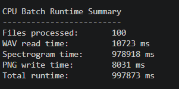

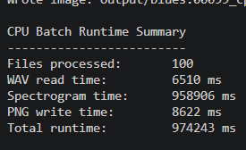

## 2. OpenCL in WSL: CPU-Backed Device Selection

During development, the OpenCL path was first tested in WSL. In that
environment, OpenCL selected a CPU-backed Intel device rather than the NVIDIA
GPU:

- `OpenCL device: GenuineIntel - cpu-haswell-13th Gen Intel(R) Core(TM) i7-13620H`

This caused the OpenCL path to perform far below the final Windows-native GPU
runs.

### WSL OpenCL local-memory batch run
- Files processed: **100**
- WAV read time: **6496 ms**
- Spectrogram time: **265033 ms**
- PNG write time: **9904 ms**
- Total runtime: **281665 ms**
- Summed GPU kernel ms: **262665 ms**

### WSL OpenCL naive batch run
- Files processed: **100**
- WAV read time: **2577 ms**
- Spectrogram time: **268658 ms**
- PNG write time: **10705 ms**
- Total runtime: **282196 ms**
- Summed GPU kernel ms: **267904 ms**

The local-memory kernel was only slightly faster than naive in this CPU-backed
OpenCL environment, and overall speedup relative to the CPU baseline was only
around **3.5x**. This turned out to be more of an OpenCL environment/device
selection issue than a kernel-design issue.

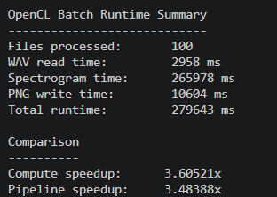

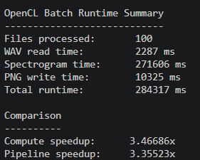

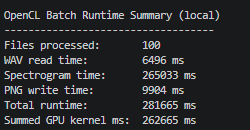

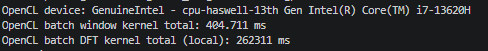

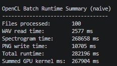

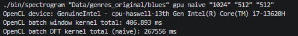

## 3. Native Windows OpenCL on the NVIDIA GPU

After building and running the project natively on Windows, OpenCL correctly
selected the NVIDIA GPU:

- `OpenCL device: NVIDIA Corporation - NVIDIA GeForce RTX 4060 Laptop GPU`

This changed performance dramatically.

### Windows OpenCL batch naive
- Files processed: **100**
- WAV read time: **320 ms**
- Spectrogram time: **2093 ms**
- PNG write time: **7694 ms**
- Total runtime: **10748 ms**
- Summed GPU kernel ms: **1339 ms**

### Windows OpenCL batch local
- Files processed: **100**
- WAV read time: **334 ms**
- Spectrogram time: **3098 ms**
- PNG write time: **7736 ms**
- Total runtime: **11743 ms**
- Summed GPU kernel ms: **1347 ms**

The improvement over the WSL CPU-backed OpenCL path was dramatic. Batch
spectrogram time dropped from roughly **265–269 seconds** to roughly
**2.1–3.1 seconds**.

Interestingly, the **naive kernel outperformed the local-memory kernel** on
the final Windows GPU-backed run. Their kernel times were nearly identical,
but the naive path produced the better overall spectrogram time. For this
direct-DFT workload and launch configuration, the overhead of local-memory
staging and synchronization appears to outweigh the benefit of reduced
global-memory access.

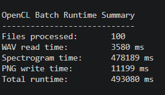

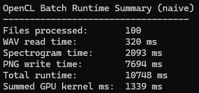

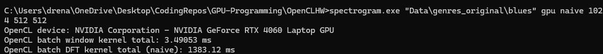

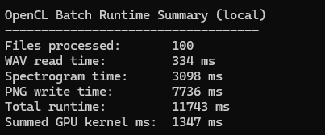

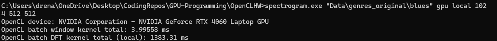

## 4. Single Long-Form Audio Benchmark: `rickroll_16bit.wav`

The strongest benchmark in the project came from comparing CPU and GPU on a
long real audio file.

Input characteristics:
- file: `rickroll_16bit.wav`
- duration: **212.01 seconds**
- sample rate: **44100 Hz**
- channels: **1**
- frames: **18260**
- bins: **512**

### CPU result
- WAV read time: **63 ms**
- Spectrogram time: **197377 ms**
- PNG write time: **844 ms**
- Total runtime: **198291 ms**

### OpenCL GPU naive result
- OpenCL device: **NVIDIA GeForce RTX 4060 Laptop GPU**
- Window kernel: **0.80384 ms**
- DFT kernel: **235.269 ms**
- WAV read time: **66 ms**
- Spectrogram time: **595 ms**
- PNG write time: **1104 ms**
- Total runtime: **1784 ms**

### Speedup
- **Compute speedup:** **331.726x**
- **Pipeline speedup:** **111.15x**

This was the clearest demonstration of the project’s value. The CPU baseline
required over **197 seconds** of spectrogram computation, while the OpenCL GPU
path completed the same stage in under **0.6 seconds**.

### Additional single-file naive vs local comparison
On the same `rickroll_16bit.wav` input:

**GPU naive**
- WAV read time: **84 ms**
- Spectrogram time: **532 ms**
- PNG write time: **904 ms**
- Total runtime: **1529 ms**
- DFT kernel time: **232.617 ms**

**GPU local**
- WAV read time: **51 ms**
- Spectrogram time: **548 ms**
- PNG write time: **917 ms**
- Total runtime: **1523 ms**
- DFT kernel time: **216.626 ms**

These single-file runs show that naive and local were close on this workload,
with local slightly lowering the DFT kernel time in one run but not producing a
clear overall end-to-end advantage.

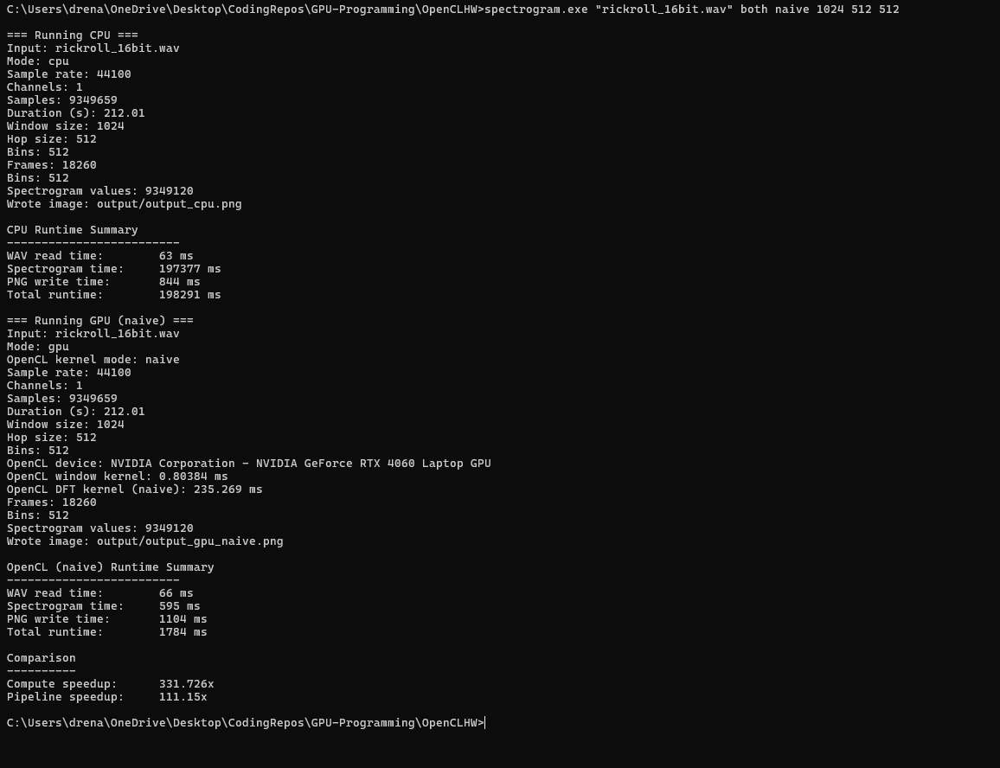

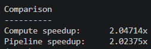

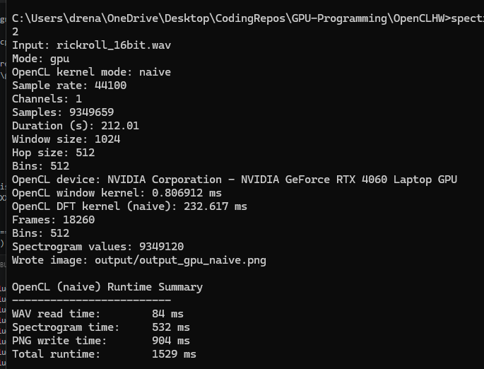

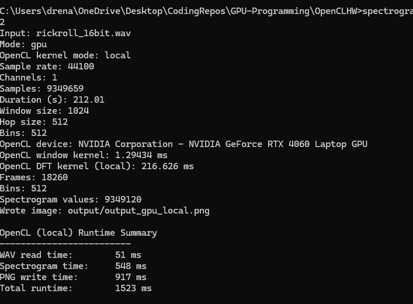

## Interpretation

Several important lessons emerged from the experiments.

First, OpenCL device selection mattered enormously. The same OpenCL code
produced radically different performance depending on whether it executed
through a CPU-backed OpenCL runtime in WSL or a GPU-backed OpenCL runtime on
native Windows.

Second, the project clearly demonstrated the value of GPU acceleration for
spectrogram generation. On the long-form Rick Astley benchmark, the OpenCL GPU
implementation reduced spectrogram compute time from **197.4 seconds** to under
**0.6 seconds**, producing a **331.7x compute speedup**.

Third, the advanced local-memory kernel was still valuable even though it was
not the fastest final kernel. Implementing it required correct use of local
memory, barriers, cooperative loading, vector types, and more careful host-side
kernel argument management. Benchmarking it against the naive kernel created a
real optimization study rather than a superficial feature add-on.

Finally, once true GPU execution was achieved, **PNG writing became a large
fraction of total runtime** in batch mode. This indicates that OpenCL compute
became efficient enough that output generation and file handling started to
dominate the overall pipeline.

## Challenges and Triumphs

A major challenge in this project was that the earliest OpenCL runs in WSL did
not use the intended NVIDIA GPU. Instead, OpenCL selected a CPU-backed Intel
device, leading to runtimes that made the program appear far slower than it
actually was. Diagnosing this required checking device strings, comparing
runtime behavior across environments, and eventually moving to a native Windows
build path.

Another challenge was implementing and wiring both the naive and local-memory
kernels correctly. The two kernels required different argument layouts and
different host-side handling. Batch mode added further complexity through
sub-buffer creation, event management, and multi-file scheduling.

The main triumph of the project was the final native Windows GPU-backed run.
Once the program targeted the RTX 4060 correctly, the OpenCL version achieved
massive speedups over the CPU baseline and produced the kind of result that
justifies GPU acceleration for this workload.

## Conclusion

This project demonstrates that OpenCL can provide substantial acceleration for
spectrogram generation when the runtime correctly targets a GPU-backed device.
The final Windows-native OpenCL implementation running on an NVIDIA GeForce
RTX 4060 Laptop GPU achieved strong performance on both batch and single-file
audio workloads, including a **331.7x compute speedup** over the CPU baseline
on a 212-second WAV file.

At the same time, the project reinforced a more important GPU programming
lesson: advanced features do not automatically guarantee better performance.
Although a local-memory DFT kernel was implemented correctly using cooperative
loading and barrier synchronization, it did not consistently outperform the
naive kernel on the final GPU-backed runs. This result was still valuable,
because it showed that optimization choices must be validated experimentally
rather than assumed.

Overall, this project moved beyond a toy OpenCL example by combining CPU and
GPU implementations, single-file and batch execution, multiple build paths,
kernel profiling, environment-aware analysis, and direct naive-vs-local kernel
comparison in one complete application.
