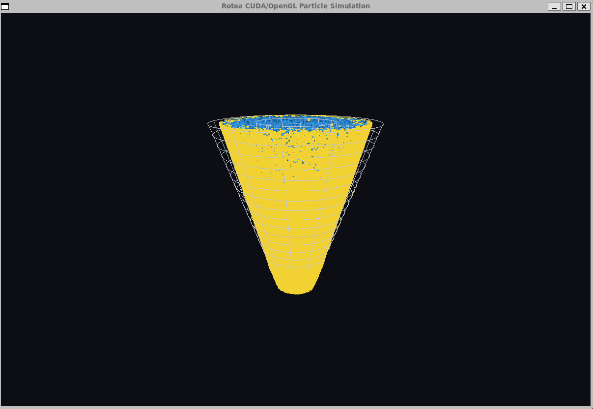
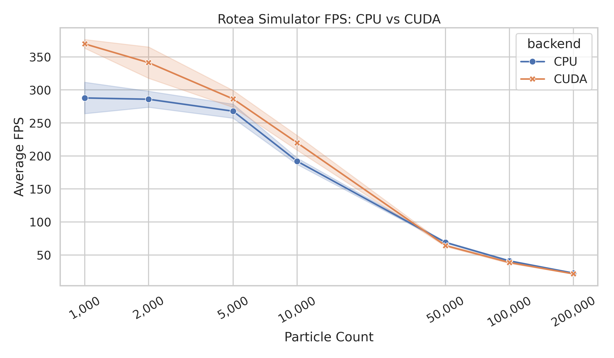
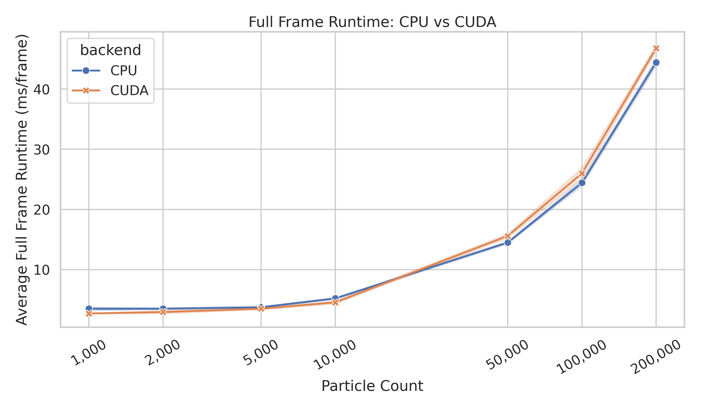
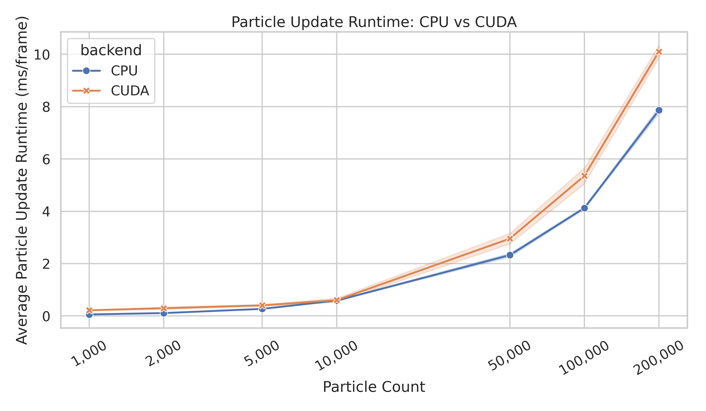
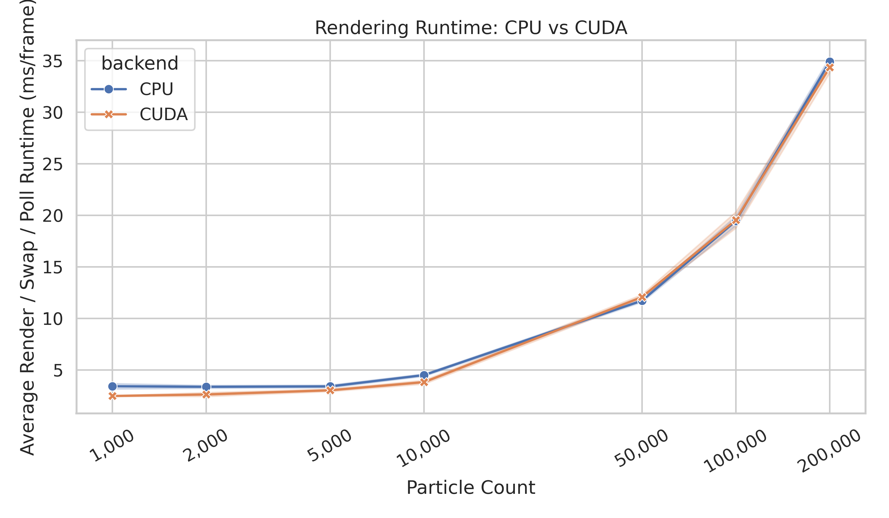
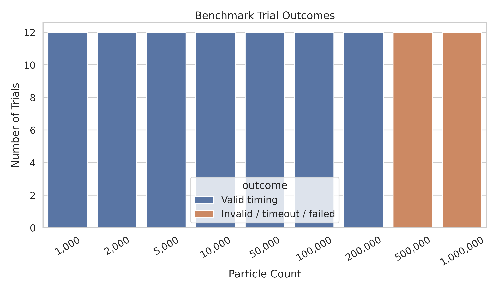
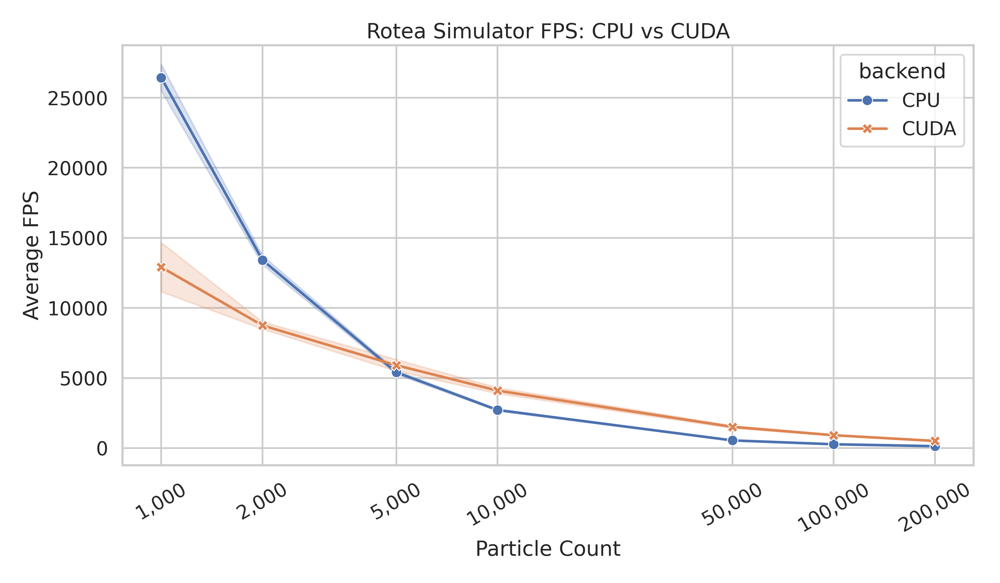
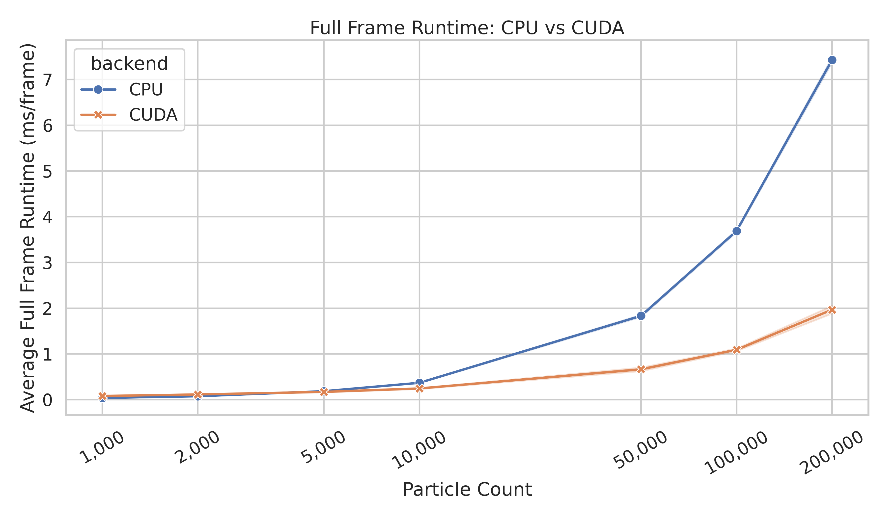
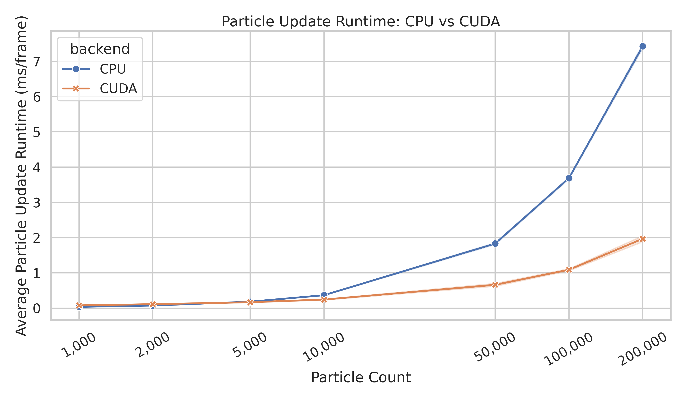
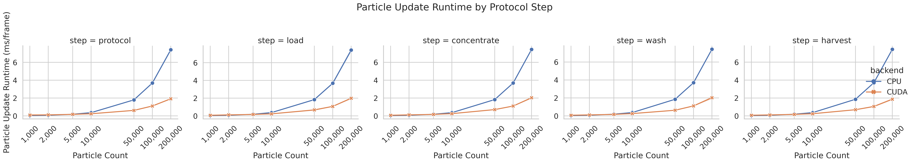

{width=85% fig-align="center"}

# Abstract

This project presents a CUDA-capable particle simulation of a Rotea-inspired counterflow centrifugation (CFC) system. The application models fluid-like and cell-like particles moving through a simplified rotating conical chamber under a normalized force-balance approximation that includes Stokes-like drag, density-dependent centrifugal migration, particle diameter effects, protocol-dependent flow, and conical chamber boundary constraints. The final software includes a CPU backend, a CUDA backend, real-time OpenGL visualization, a standalone CUDA frame generator, replay visualization, synchronous visual benchmarking, and headless benchmarking.

The project was designed around two related questions. First, can a Rotea-inspired particle system be implemented in a form suitable for real-time scientific visualization? Second, when does CUDA meaningfully improve the simulation, and when is the benefit limited by application architecture? The answer depended strongly on benchmark context. The synchronous visual benchmark measured the complete interactive application loop, including particle updates, host-device transfer, synchronization, rendering, buffer swap, and event polling. In that setting, CUDA produced higher frame rates at small particle counts but did not provide a large end-to-end advantage at higher counts. The headless benchmark disabled OpenGL rendering and measured the update loop more directly. In that setting, CUDA overtook CPU performance once the workload was large enough and reached approximately 3.78x average update-speed improvement at 200,000 particles.

The main conclusion is that CUDA acceleration is valuable only when the workload and application architecture expose enough parallel computation to offset launch, synchronization, and data-movement costs. For this project, CUDA clearly improved isolated particle-update throughput at larger particle counts. However, full visual application speedup was limited by rendering and CPU/GPU coordination. This is an important practical result: knowing when and how to use CUDA is as important as implementing a CUDA kernel.

# Introduction

Cell and gene therapy manufacturing increasingly depends on closed, automated, and reproducible processing systems. Li, James, and Lim (2023) describe the Gibco CTS Rotea Counterflow Centrifugation System as an automated cell-processing device developed for manufacturing cell therapy products. They frame the system in the context of broader manufacturing challenges in cell therapy, where manual open processing is difficult to scale and automated unit operations are desirable for reproducibility, process control, and eventual clinical production.

Counterflow centrifugation is an appropriate domain for a GPU programming final project because it combines a clear physical mechanism with a naturally parallel computational structure. In a CFC chamber, many particles or cells move under the combined effects of chamber rotation, fluid flow, particle size, particle density, media density, and media viscosity. Each particle can be updated independently at a given time step, which maps well to CUDA's single-instruction, multiple-thread execution model.

The goal of this project was not to reproduce the full engineering complexity of the CTS Rotea instrument. Instead, the goal was to develop a physically motivated, visualization-oriented simulation that demonstrates CUDA programming concepts in a biologically meaningful setting. The simulator therefore uses normalized units, simplified conical chamber geometry, approximate local flow behavior, and a particle-based update model. These choices support real-time rendering and reproducible benchmarking while preserving the qualitative dependencies described in Rotea training materials.

# Domain Background: Counterflow Centrifugation and Rotea Motivation

The Rotea system is relevant to cell therapy manufacturing because it addresses processing steps such as washing, buffer exchange, volume reduction, and elutriation. Li et al. (2023) identify automated washing and buffer exchange as a technology gap for autologous cell manufacturing, particularly where input volumes below 1 L and output volumes of 5--50 mL are common. The same article describes early Rotea work showing enclosed, automated cell washing, buffer exchange, and volume reduction with high cell recovery while retaining cell function. This project uses that context as motivation: a particle simulation can help make the otherwise hidden behavior of a CFC chamber interpretable.

Rotea SmartStart training material describes counterflow centrifugation as a balance between two opposing effects: centripetal force due to rotation of the CFC chamber and Stokes drag experienced by particles in a flowing viscous fluid (Thermo Fisher Scientific, 2026). The training material also explains the process qualitatively: cells enter the chamber with a flow rate, smaller cells may not remain in equilibrium and can exit through the top of the chamber, and the conical chamber balances flow force with G-force for cells of a particular size and density. The material further notes that particles are more likely to remain in the chamber when centrifuge speed is increased or flow rate is lowered, while particles are more likely to elutriate when flow rate is raised or centrifuge speed is lowered.

The same training material identifies seven parameters that influence stable fluidized bed formation: cell diameter, cell density, G-force, flow rate, media density, media viscosity, and cell concentration. This list directly informed the simulation model. The implemented model does not calibrate these variables in physical units, but it does preserve their qualitative roles. Particle diameter and density influence centrifugal retention, flow rate influences fluid-driven transport, media density and viscosity appear in the normalized drag relationship, and conical chamber geometry changes local flow behavior.

# Physical Model

The simulation is built around the force-balance idea presented in the Rotea training material. In simplified form, the implemented conceptual model is:

$$
F_{net} = F_{centrifugal} - F_{Stokes\ drag}
$$

The Stokes-like drag term follows the dependency:

$$
F_{Stokes\ drag} \propto 3\pi\eta v d
$$

and the centrifugal migration term follows the dependency:

$$
F_{centrifugal} \propto \frac{(\rho_p - \rho_m)\pi d^3\omega^2r}{6}
$$

where $\rho_p$ is particle density, $\rho_m$ is media density, $d$ is particle diameter, $\omega$ is angular velocity, $r$ is radial particle position, $\eta$ is media viscosity, and $v$ is local fluid velocity. In the simulator, these relationships are scaled into normalized visualization units rather than SI units. This makes the model stable for real-time rendering while retaining the expected physical directionality: larger and denser particles experience stronger centrifugal retention, flow promotes axial transport and elutriation, and the cone geometry affects local velocity.

The chamber is modeled as a conical annulus with inner and outer radii that vary with axial position. This approximates the qualitative Rotea concept that chamber geometry affects local velocity and retention behavior. The model also includes four protocol phases: load, concentrate, wash, and harvest. These phases change the effective flow and G-force conditions, matching the way Rotea protocol development relies on adjusting centrifuge speed and pump speed.

The model should be interpreted as physically motivated, not experimentally validated. It is suitable for scientific visualization, software demonstration, and performance benchmarking. It is not suitable for predicting actual cell recovery, purity, washout, or process settings.

# Software Architecture

The project is organized into a CPU simulation backend, a CUDA simulation backend, an OpenGL renderer, and Python scripts for benchmarking and plotting. The core files are summarized below.

| File | Purpose |
|---|---|
| `main.cpp` | Command-line parsing, visual application loop, replay mode, protocol selection, benchmark summary printing, and headless benchmark mode. |
| `sim_cpu.cpp` / `sim_cpu.h` | CPU-side chamber, bag, protocol, and particle-update logic. |
| `simulation.cu` / `simulation.h` | CUDA kernel, persistent device buffer, live CUDA update path, and standalone CUDA frame generator. |
| `renderer.cpp` / `renderer.h` | OpenGL rendering of chamber geometry and particles. |
| `types.h` | Shared particle, bag, chamber, line, and protocol structures. |
| `benchmark.py` | Synchronous visual benchmark runner using duration-based OpenGL runs. |
| `benchmark_headless.py` | Headless benchmark runner using fixed update steps and no OpenGL window. |
| `benchmark_plot.py` | Plotting and summarization workflow for CPU/CUDA benchmark data. |

: Major project files and responsibilities. {#tbl-architecture}

The application can be run in four primary modes. CPU visual mode renders a live OpenGL simulation using CPU particle updates. CUDA visual mode renders a live OpenGL simulation while updating particles with a CUDA kernel. Replay mode visualizes precomputed CUDA frames written by the standalone frame generator. Headless mode runs the update loop without creating an OpenGL window and is used for cleaner CPU/CUDA timing comparisons.

# CUDA Implementation

The CUDA implementation uses a one-thread-per-particle strategy with a grid-stride loop. This allows the same kernel to update particle arrays larger than the number of launched CUDA threads. The live CUDA path allocates a persistent device buffer and reuses it across frames. For each update step, particle data are copied from host memory to device memory, updated by the CUDA kernel, synchronized, copied back to host memory, and then rendered by OpenGL.

This architecture is intentionally straightforward and reliable, but it has an important performance implication. In visual CUDA mode, particle data still round-trip between CPU and GPU each frame because the OpenGL renderer consumes CPU-side particle positions. As a result, the visual CUDA path includes kernel execution as well as host-device transfer and synchronization costs. This design is appropriate for a course project and for demonstrating CUDA memory management, but it is not the optimal architecture for a production GPU visualization pipeline.

The standalone CUDA frame generator is a second CUDA pathway. It generates particle frames offline, writes them to a replay binary file, and allows the OpenGL visualizer to replay the precomputed particle data. This feature separates CUDA frame generation from interactive visualization and provides an additional demonstration of GPU-side particle simulation.

# Benchmark Design

Two benchmark designs were used because they answer different performance questions.

The synchronous visual benchmark measures the full interactive application. It includes system updates, particle updates, host-device transfers in CUDA mode, kernel synchronization, OpenGL rendering, buffer swap, event polling, and display-loop behavior. This benchmark answers: *How fast is the complete interactive application?*

The headless benchmark disables OpenGL rendering and runs a fixed number of update steps. It still uses the same CPU and CUDA update functions, but it removes the rendering loop and display behavior. This benchmark answers: *How fast is the update loop when rendering is removed?*

This distinction is essential. A GPU kernel may be faster than a CPU loop, but the full application may not be faster if rendering, synchronization, or memory movement dominate frame time. The two benchmark modes therefore provide complementary evidence: synchronous mode evaluates user-visible runtime, while headless mode isolates the simulation update more directly.

# Results: Synchronous Visual Benchmark

The synchronous benchmark was run across particle counts from 1,000 to 200,000 for completed timing runs, with larger 500,000 and 1,000,000 particle visual runs treated as stress tests when the timing harness failed to collect complete timing summaries. The visual benchmark should be interpreted as an end-to-end application test, not as a pure CUDA kernel benchmark.

{#fig-visual-fps width=95%}

{#fig-visual-frame-runtime width=95%}

{#fig-visual-particle-update width=95%}

{#fig-visual-render-runtime width=95%}

{#fig-timeout-summary width=95%}

| Particles | CPU FPS | CUDA FPS | CUDA FPS change | CPU update ms | CUDA update ms |
|---:|---:|---:|---:|---:|---:|
| 1,000 | 287.821 | 369.733 | +28.5% | 0.058 | 0.217 |
| 2,000 | 285.851 | 341.292 | +19.4% | 0.110 | 0.296 |
| 5,000 | 267.752 | 286.315 | +6.9% | 0.271 | 0.405 |
| 10,000 | 192.002 | 219.901 | +14.5% | 0.588 | 0.606 |
| 50,000 | 68.996 | 64.171 | -7.0% | 2.326 | 2.955 |
| 100,000 | 40.962 | 38.523 | -6.0% | 4.125 | 5.354 |
| 200,000 | 22.512 | 21.380 | -5.0% | 7.861 | 10.102 |

: Selected synchronous visual benchmark results averaged across valid trials and protocol steps. {#tbl-visual-results}

The synchronous visual benchmark showed mixed CUDA behavior. At small particle counts, the CUDA executable produced higher overall FPS than the CPU executable. However, the CUDA particle-update time was not consistently lower than the CPU update time in visual mode. At 50,000 particles and above, CPU visual mode slightly outperformed CUDA in overall FPS.

This result is not a contradiction. The synchronous benchmark measures the full application path. The CUDA visual path performs GPU computation, but it also performs host-device particle transfers and a full synchronization before rendering. OpenGL rendering and display-loop behavior also contribute substantially to total frame time. Therefore, the visual benchmark shows that simply moving particle updates to CUDA is not sufficient to guarantee a large end-to-end speedup when the rest of the application remains CPU/OpenGL-centered.

# Results: Headless Update Benchmark

The headless benchmark clarified the performance of the particle-update workload itself. With OpenGL rendering disabled, CPU was faster at the smallest particle counts, but CUDA became faster once the particle count was large enough to amortize kernel launch, synchronization, and transfer costs.

{#fig-headless-fps width=95%}

{#fig-headless-frame-runtime width=95%}

{#fig-headless-particle-update width=95%}

{#fig-headless-particle-update-step width=95%}

| Particles | CPU update ms | CUDA update ms | CUDA speedup | Interpretation |
|---:|---:|---:|---:|---|
| 1,000 | 0.038 | 0.080 | 0.47x | CPU faster |
| 2,000 | 0.074 | 0.114 | 0.65x | CPU faster |
| 5,000 | 0.185 | 0.170 | 1.09x | CUDA slight |
| 10,000 | 0.368 | 0.244 | 1.51x | CUDA faster |
| 50,000 | 1.833 | 0.663 | 2.76x | CUDA faster |
| 100,000 | 3.688 | 1.091 | 3.38x | CUDA faster |
| 200,000 | 7.427 | 1.967 | 3.78x | CUDA faster |

: Headless update benchmark results averaged across protocol phases and trials. {#tbl-headless-results}

The headless results are the strongest evidence that the CUDA backend accelerated the particle-update workload. At 10,000 particles, CUDA reduced average update time from 0.368 ms to 0.244 ms, corresponding to a 1.51x speedup. At 200,000 particles, CUDA reduced average update time from 7.427 ms to 1.967 ms, corresponding to a 3.78x speedup. The crossover occurred between 2,000 and 5,000 particles. Below that range, the CPU loop was faster because the workload was too small to justify CUDA overhead. Above that range, the one-thread-per-particle CUDA strategy increasingly favored the GPU.

# Discussion

The most important result of this project is that benchmark context determines the performance conclusion. In the synchronous visual benchmark, CUDA did not produce a large end-to-end speedup because the application measured more than particle computation. It measured the entire interactive rendering loop. In the headless benchmark, CUDA showed clear scaling benefits because rendering was removed and the update workload was isolated.

This is a practical demonstration of Amdahl's law. Accelerating particle updates cannot proportionally accelerate the entire application if rendering, synchronization, or memory transfers remain large contributors to runtime. The synchronous benchmark showed that OpenGL rendering and display-loop costs became substantial as particle count increased. The headless benchmark showed that the CUDA update kernel itself became increasingly advantageous at larger particle counts. Both results are correct; they answer different questions.

The project also shows why data movement matters in GPU programming. The live CUDA visual path uses a persistent CUDA allocation, but particle ownership still alternates between CPU and GPU each frame. The GPU updates particles, but the particles are copied back to the CPU so that OpenGL can render them. A more optimized architecture would keep particle data resident on the GPU and render from a CUDA-updated OpenGL buffer.

From a modeling perspective, the simulation successfully captures the qualitative Rotea-inspired relationships: flow and G-force oppose one another, larger and denser particles are preferentially retained, media density and viscosity influence drag behavior, and wash/harvest phases modify the effective transport behavior. However, the simulator remains a normalized educational model. It does not include full kit fluidics, sensor behavior, pressure-driven control, experimentally calibrated chamber geometry, or CFD-resolved fluid motion.

# Limitations

This project is a GPU programming simulation and visualization project, not a validated process-development tool. The main limitations are:

- The simulation uses normalized units rather than calibrated SI units.
- The CFC chamber is simplified as a conical annulus.
- The local fluid field is approximated rather than solved with computational fluid dynamics.
- The model has not been validated against experimental Rotea, bead, or cell-run data.
- Live CUDA mode still copies particle buffers between host and device each frame.
- CUDA/OpenGL interoperability is not implemented.
- Bubble trap behavior, pressure triggers, optical-density sensor behavior, detailed kit fluidics, and real protocol-builder triggers are simplified or omitted.
- High-particle-count visual timing can become unreliable because the interactive loop and timing harness dominate runtime.

# Future Work

The most important future optimization would be CUDA/OpenGL interoperability. In the current live CUDA design, particles are copied from CPU to GPU, updated in CUDA, copied back to CPU, and then rendered by OpenGL. A more optimized architecture would register an OpenGL vertex buffer object with CUDA, allow the CUDA kernel to update that buffer directly, and then render the same GPU-resident buffer without a CPU round trip.

Other future improvements include:

- Structure-of-arrays particle memory layout for improved GPU memory coalescing.
- CUDA event timing for live visual mode.
- Numerical validation tests comparing CPU and CUDA particle statistics.
- Calibrated physical units for flow rate, chamber dimensions, and angular velocity.
- More realistic local cross-sectional flow calculations.
- Interactive controls for G-force, flow rate, media density, and media viscosity.
- Experimental comparison against bead or cell processing runs.

# Conclusion

This project implemented a CUDA-capable, Rotea-inspired CFC particle simulator with real-time OpenGL visualization, CPU and CUDA execution modes, replay generation, and reproducible benchmarking. The final system demonstrates CUDA programming concepts including device memory allocation, persistent buffers, kernel launches, grid-stride loops, synchronization, error checking, and CPU/GPU performance comparison.

The final benchmark results provide a practical CUDA lesson. In the complete synchronous visual application, CUDA did not guarantee large end-to-end speedups because rendering, synchronization, and host-device data movement affected the frame loop. In the isolated headless benchmark, CUDA provided clear update-speed improvements once the particle count was large enough, reaching approximately 3.78x speedup at 200,000 particles. Therefore, the final takeaway is not simply that CUDA is faster or slower. The correct lesson is that CUDA is most effective when the workload is large, parallel, compute-heavy enough, and structured to minimize data movement.

# References

Li, A., James, D., & Lim, R. (2023). The Gibco™ CTS™ Rotea™ system story—a case study of industry-academia collaboration. *Gene Therapy, 30*(3--4), 192--196. https://doi.org/10.1038/s41434-021-00266-6

Thermo Fisher Scientific. (2026). *CTS Rotea Counterflow Centrifugation System SmartStart Training*. Thermo Fisher Scientific.

# Appendix: Reproduction Commands

Build the project:

```bash
make clean
make all
```

Run a synchronous visual CPU simulation:

```bash
./bin/rotea_sim --mode cpu --particles 5000 --step protocol --duration 10
```

Run a synchronous visual CUDA simulation:

```bash
./bin/rotea_sim_cuda --mode cuda --particles 5000 --step protocol --duration 10
```

Run a CPU headless benchmark:

```bash
./bin/rotea_sim --mode cpu --headless --particles 10000 --step protocol --steps 10000
```

Run a CUDA headless benchmark:

```bash
./bin/rotea_sim_cuda --mode cuda --headless --particles 10000 --step protocol --steps 10000
```

Generate visual benchmark data:

```bash
python benchmark.py
```

Generate headless benchmark data:

```bash
python benchmark_headless.py
```

Generate benchmark plots:

```bash
python benchmark_plot.py
```
