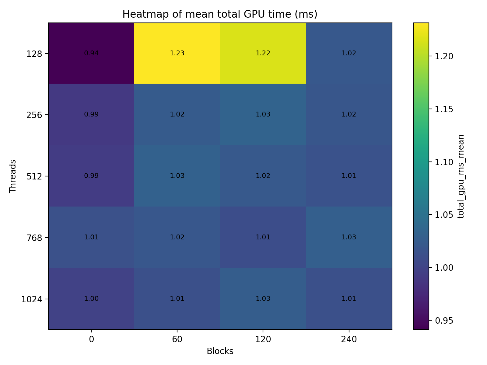
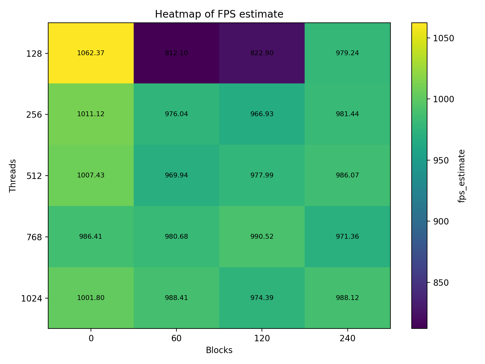
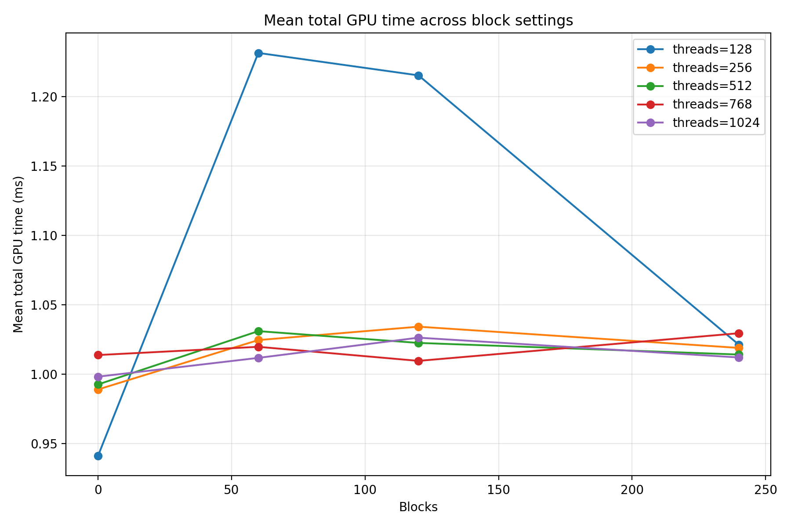
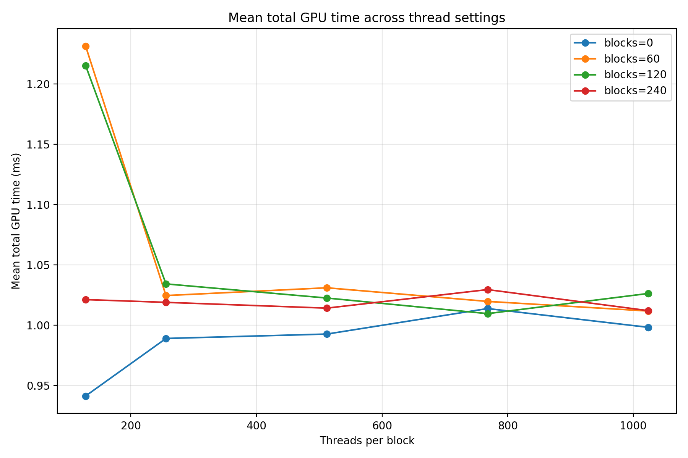
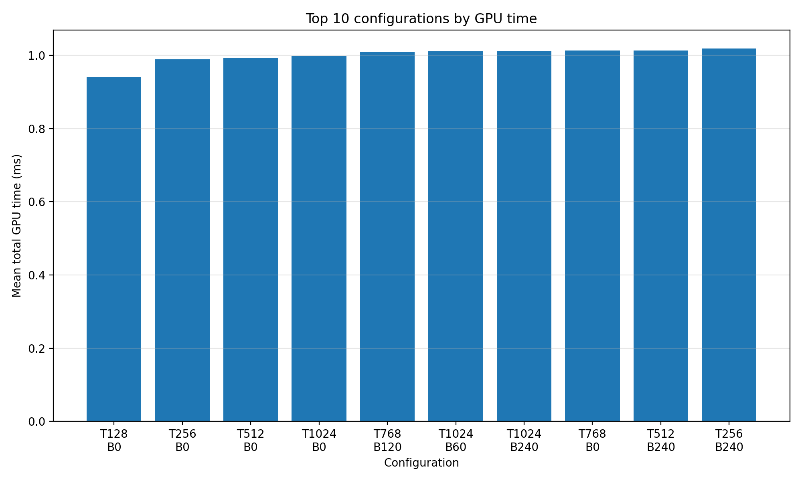

#### Dylan Renard  
#### EN.605.617 Introduction to GPU Programming (JHU)  
#### Professor Chance Pascale  
#### March 9th 2026  

# CUDA Streams and Events Assignment  
## Dual Emulator Frame Processing with Concurrent CUDA Streams

---

# Overview

This project demonstrates the use of **CUDA Streams** and **CUDA Events** to process two independent graphics workloads concurrently on the GPU.

Two Game Boy Advance emulator instances are executed simultaneously using the **libretro mGBA core**. Each emulator produces RGB565 video frames which are transferred to the GPU where CUDA kernels perform:

• Bilinear image upscaling  
• Nearest-neighbor baseline scaling  
• Pixel difference heatmap generation  
• Frame metric reductions  
• Composite rendering for visualization  

The system renders a **2×3 visualization panel** while also collecting **per-frame GPU timing metrics** for benchmarking different CUDA execution configurations.

This project focuses on demonstrating:

* CUDA stream concurrency
* GPU kernel timing with CUDA events
* Effects of thread/block configuration on performance
* Visual debugging of GPU image processing kernels

---

# Repository Structure

```
StreamsHW/

GBAROMS/
    Pokemon - FireRed Version (USA, Europe).gba
    Pokemon - LeafGreen Version (USA).gba

mgba/
    (libretro emulator source)

streams_hw.cu
streams_hw.cpp
Makefile

runner.py
scripts/
    plots.py

plots/
    heatmap_fps.png
    heatmap_total_gpu_ms.png
    scatter_total_gpu_vs_threads.png
    lines_total_gpu_by_thread.png
    lines_total_gpu_by_block.png
    top_configs_bar.png
    best_config_kernel_breakdown.png

    Example of minor difference on bilinear transform.png
    Example of partial coverage.png
    Example of pixel difference .png
    RNG 2.png
    RNG Divergence.png

runner_results/
    summary.csv
```

---

# Build Instructions

From the project root:

```
make
```

This produces two executables:

```
streams_hw_cuda
streams_hw_libretro
```

The CUDA benchmark experiments use:

```
streams_hw_cuda
```

---

# Running the Emulator Pipeline

Run the program:

```
./streams_hw_cuda
```

This launches two synchronized emulator instances and processes their frame buffers on the GPU.

The window displays a **2×3 visualization grid**.

Top row  
• FireRed bilinear upscale  
• LeafGreen bilinear upscale  

Middle row  
• FireRed nearest neighbor upscale  
• LeafGreen nearest neighbor upscale  

Bottom row  
• Self difference heatmap  
• Cross game difference heatmap  

Controls:

WSAD for movement

KP 2 and 3 for start and select

KP 4 and 4 for A and B

KP 7 and 9 for L and R


```
ESC   Exit program
```

---

# Using Your Own ROMs

ROM files are **not included** in the repository.

You may load your own legally obtained ROM dumps:

```
./streams_hw_cuda \
  --fr ./GBAROMS/MetroidFusion.gba \
  --lg ./GBAROMS/MarioKart.gba
```

The program will run both ROMs simultaneously and process their frames using the CUDA pipeline.

---

# CUDA Execution Model

The GPU pipeline uses **two CUDA streams**.

Stream 1

```
FireRed bilinear upscale
Self difference heatmap
Composite operations
```

Stream 2

```
LeafGreen bilinear upscale
```

Because the two upscale kernels are independent they can execute concurrently on the GPU.

CUDA events are used to measure:

• FireRed upscale time  
• LeafGreen upscale time  
• Self difference heatmap time  
• Cross difference heatmap time  
• Total GPU frame time  

---

# Benchmark Methodology

To analyze GPU performance across launch configurations, a parameter sweep was performed.

Threads per block tested:

```
128
256
512
768
1024
```

Block counts tested:

```
0 (automatic grid sizing)
60
120
240
```

Each configuration processed:

```
2500 frames
```

Benchmark runner:

```
python3 runner.py \
  --exe ./streams_hw_cuda \
  --frames 2500 \
  --threads 128 256 512 768 1024 \
  --blocks 0 60 120 240
```

Results are written to:

```
runner_results/summary.csv
```

---

# Generating Performance Plots

Plot generation script:

```
python3 scripts/plots.py \
  --csv runner_results/summary.csv \
  --outdir plots
```

Generated figures:

```
plots/heatmap_fps.png
plots/heatmap_total_gpu_ms.png
plots/scatter_total_gpu_vs_threads.png
plots/lines_total_gpu_by_thread.png
plots/lines_total_gpu_by_block.png
plots/top_configs_bar.png
plots/best_config_kernel_breakdown.png
```

---

# Performance Results

## Total GPU Time Heatmap



## FPS Heatmap



## Threads vs GPU Time



## Block scaling



## Top Configurations



---

# Best Configuration

Observed optimal configuration:

```
threads per block: 128
blocks: automatic grid
```

Average GPU frame time:

```
~0.94 ms
```

Approximate throughput:

```
~1060 FPS
```

---

# Kernel Timing Breakdown

Example kernel timing distribution:


Approximate timings:

```
FireRed upscale     ≈ 0.87 ms
LeafGreen upscale   ≈ 0.94 ms
Self difference     ≈ 0.07 ms
Cross difference    ≈ 0.04 ms
```

Because the two upscale kernels execute in **separate CUDA streams**, their execution overlaps.

Without streams the total would be approximately:

```
0.87 + 0.94 = 1.81 ms
```

Measured total GPU time is approximately:

```
~1.0 ms
```

This confirms **concurrent kernel execution**.

---

# Visual Debugging Examples

The GPU visualizations also served as debugging tools during kernel development.

---

## Pixel Difference Heatmap


Even when images appear visually identical, the heatmap reveals small interpolation differences.

---

## Bilinear Interpolation Differences


Bilinear interpolation introduces subtle color differences relative to nearest neighbor scaling.

---

## Partial GPU Coverage


When the CUDA grid does not launch enough threads to cover the image domain, only part of the frame is processed.

This visualization helped diagnose **under-provisioned thread configurations** during testing.

---

# Emulator Divergence

Because the two emulator instances run independently, RNG events may diverge.

This produces slightly different gameplay outcomes.


Even with identical inputs, independent RNG state can cause the games to evolve differently.

---

# Conclusion

This project demonstrates how CUDA streams allow independent workloads to execute concurrently on the GPU. By processing frames from two emulator instances simultaneously, the system illustrates how stream concurrency reduces effective runtime compared to sequential execution.

Benchmark experiments further show that GPU performance depends heavily on launch configuration. Moderate thread counts around 128–256 threads per block provided the best performance on the tested hardware.

Overall, the project highlights how CUDA streams, events, and careful launch configuration tuning interact to determine the performance characteristics of GPU applications.